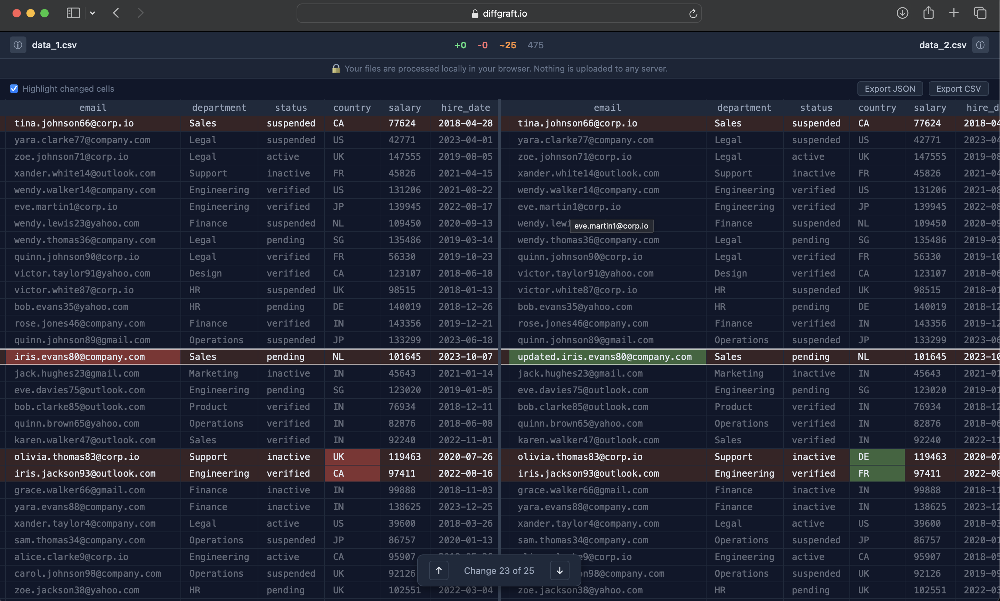

# DiffGraft

Structural CSV diff tool. Open two files, see exactly what changed.

[](LICENSE)
[](https://www.rust-lang.org/)
[](https://webassembly.org/)



## What is DiffGraft

Most CSV diff tools do line-by-line text comparison. This breaks the moment a file is sorted differently, has columns reordered, or has rows inserted in the middle. DiffGraft does structural diffing: it matches rows by primary key, compares column by column, and reports exactly which cells changed.

It runs entirely in your browser using WebAssembly. Your files are never uploaded anywhere — all processing happens locally on your machine.

## Features

- Primary key aware row matching (single and composite keys)
- Cell-level change highlighting in the diff view
- Side-by-side view with synchronised scroll
- IntelliJ-style change navigation (F7 / Shift+F7 / Alt+↓↑)
- Drag and drop or click-to-open file loading
- Export diff as JSON
- Files never leave your browser — processed via WebAssembly
- Handles files up to 200MB
- Free and open source (Apache 2.0)
- Desktop app available (Tauri, macOS / Windows / Linux)

## Try It

👉 https://diffgraft.io

## How It Works

1. Open two CSV files — drag and drop, or click to open
2. Set your primary key column (auto-detected from column names)
3. See exactly what changed — added rows, deleted rows, modified cells

## Why Primary Key Matching Matters

A naive text diff of two CSVs compares line 1 against line 1, line 2 against line 2. If the file was re-sorted, every row appears to have changed. A 10,000-row CSV sorted Z-A instead of A-Z produces 9,847 false changes in a text diff. With primary key matching, DiffGraft identifies each row by its key value and compares the right rows against each other — zero false changes from resorting.

## Tech Stack

| Layer | Technology |
|-------|------------|
| Diff engine | Rust |
| Browser runtime | WebAssembly (wasm-bindgen) |
| Desktop app | Tauri v2 |
| Frontend | React + TypeScript |
| Build tool | Vite |
| Deployment | Cloudflare Pages |

## Running Locally

### Prerequisites

- Rust (latest stable)
- Node.js v18+
- wasm-pack

### Desktop app

```bash
git clone https://github.com/cyantree-git/diffgraft
cd diffgraft/apps/desktop
npm install
npm run tauri dev
```

### Web app

```bash
cd apps/web
npm install
npm run build:wasm
npm run dev
```

Open http://localhost:3001

## Project Structure

```
diffgraft/
├── crates/
│   └── diffgraft-core/     Rust diff engine (platform agnostic)
│       ├── src/reader.rs   CSV parsing
│       ├── src/diff.rs     Structural diff algorithm
│       ├── src/merge.rs    Cherry-pick merge engine
│       ├── src/export.rs   JSON and CSV export
│       └── src/wasm.rs     WebAssembly bindings
├── apps/
│   ├── desktop/            Tauri desktop application
│   └── web/                Vite web application
```

## Tests

```bash
cd crates/diffgraft-core
cargo test
```

63 unit tests covering the diff engine, merge engine, and export functions.

## Contributing

Issues and pull requests are welcome. Before submitting a PR, run `cargo test` and make sure all 63 tests pass. Follow the existing code style — no `unwrap()`, no `expect()`, use the `?` operator throughout.

## Roadmap

- [ ] Cherry-pick merge UI
- [ ] JSON diff support
- [ ] Parquet support (desktop)
- [ ] CLI interface
- [ ] MCP server for Claude Code integration
- [ ] TreeGraft — Git merge intelligence (sister project)

## Privacy

DiffGraft processes all files locally in your browser using WebAssembly. No data is sent to any server. The source code is open for anyone to verify.

## License

Apache 2.0 — see [LICENSE](LICENSE).

